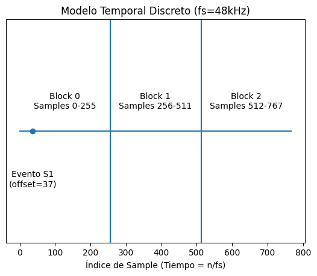

# HeartDSP -- Modelo Temporal con Diagrama

## Tiempo Discreto en Audio Digital

Cada sample representa un instante exacto en el tiempo:

t = n / fs

Para fs = 48.000 Hz:

-   Δt = 1/48000 ≈ 20.833 µs
-   Sample 0 → t = 0
-   Sample 1 → t = 1/fs
-   Sample n → t = n/fs

El tiempo del DSP está completamente definido por el índice de muestra.

------------------------------------------------------------------------

## Generación por Bloques

El DSP genera audio bajo demanda en bloques:

render(N)

Si N = 256:

-   Bloque 0 → Samples 0--255
-   Bloque 1 → Samples 256--511
-   Bloque 2 → Samples 512--767

Aunque se generen por bloques, el tiempo es continuo.

------------------------------------------------------------------------

## Evento Intra-Bloque

Un evento puede comenzar dentro de un bloque.

Ejemplo: S1 comienza en el sample 37 del bloque.

La voice escribe: - Ceros hasta el offset - Señal desde el offset hasta
el final del bloque

------------------------------------------------------------------------

## Diagrama Ilustrativo

------------------------------------------------------------------------

## Separación de Relojes

-   El reloj físico pertenece al DAC / sistema de reproducción.
-   El DSP solo genera muestras consecutivas.
-   El contador de muestras generadas define el tiempo lógico.

Mientras no se pierdan ni dupliquen muestras, el tiempo es
matemáticamente exacto.
